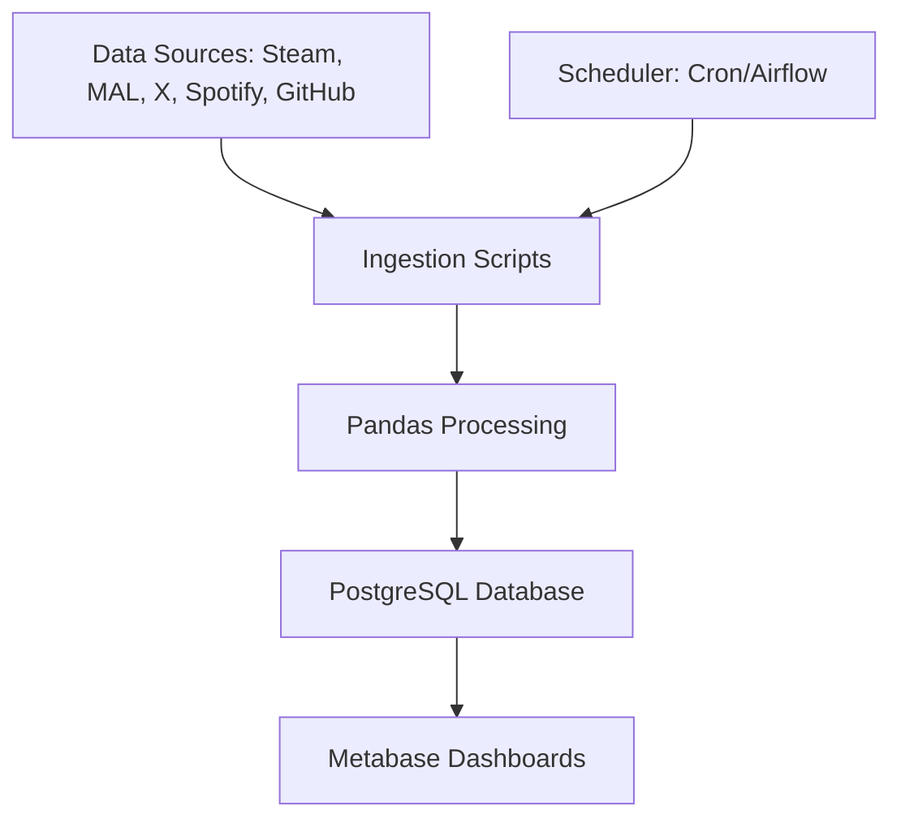

# Personal Data Aggregation Pipeline Plan

## Project Overview
This project aims to build a personal data aggregation system that pulls data from various online services (Steam, MyAnimeList, X/Twitter, Spotify, GitHub), cleans and processes it, stores it in a PostgreSQL database, and enables reporting via Metabase dashboards. The system will run as a scheduled pipeline to keep data up-to-date, providing insights into personal digital activity across platforms.

## Objectives
- **Data Ingestion**: Automate pulling of user data from multiple APIs.
- **Data Processing**: Clean, normalize, and transform raw data for consistency.
- **Data Storage**: Persist processed data in PostgreSQL with a structured schema.
- **Reporting**: Create interactive dashboards in Metabase for visualization and analysis.
- **Scalability**: Design for easy addition of new data sources.
- **Privacy/Security**: Handle API keys securely and ensure data is stored locally.

## Technology Stack
- **Language**: Python 3.8+
- **Libraries**:
  - `requests`: HTTP requests for APIs.
  - `pandas`: Data cleaning and transformation.
  - `psycopg2`: PostgreSQL connectivity.
  - Service-specific: `steam`, `mal-api`, `tweepy`, `spotipy`, `PyGitHub`.
  - `schedule`: For periodic runs.
- **Database**: PostgreSQL (local or Docker).
- **Reporting**: Metabase (Docker-based).
- **Orchestration**: Cron jobs or Apache Airflow (optional for complexity).
- **Environment**: Virtualenv for Python dependencies.

## Architecture
The pipeline follows an ETL (Extract, Transform, Load) pattern:

1. **Extract**: API calls to fetch raw data.
2. **Transform**: Pandas for cleaning (e.g., handle missing values, standardize formats).
3. **Load**: Insert into PostgreSQL tables.

Metabase connects to PostgreSQL for querying and visualization.

### High-Level Diagram


## Folder Structure
```
Projects/PersonalDataAggregationPipeline/
├── src/
│   ├── ingestion/
│   │   ├── steam_ingest.py
│   │   ├── mal_ingest.py
│   │   ├── twitter_ingest.py
│   │   ├── spotify_ingest.py
│   │   └── github_ingest.py
│   ├── processing/
│   │   └── data_cleaner.py
│   ├── database/
│   │   ├── schema.sql
│   │   └── db_utils.py
│   └── main.py
├── config/
│   ├── .env.example
│   └── config.py
├── tests/
│   └── test_pipeline.py
├── docs/
│   └── plan.md
├── requirements.txt
├── Dockerfile (optional for containerization)
└── README.md
```

## Implementation Steps
1. Set up project folder and virtual environment.
2. Install dependencies and configure PostgreSQL.
3. Design database schema for each data source.
4. Implement ingestion scripts for each API.
5. Build data processing module with Pandas.
6. Integrate database loading.
7. Set up Metabase and create sample dashboards.
8. Implement scheduling for automated runs.
9. Add error handling, logging, and tests.
10. Document setup and usage.

## Assumptions and Risks
- **APIs**: All sources provide free API access with reasonable limits; user must obtain API keys.
- **Data Volume**: Personal use, so low volume; scale if needed.
- **Security**: API keys stored securely; no sensitive data shared.
- **Risks**: API changes, rate limits; mitigate with retries and monitoring.

## Next Steps
Review this plan. If approved, proceed to implementation in Code mode.